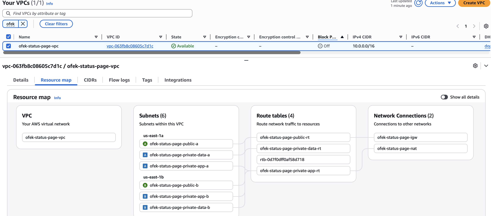
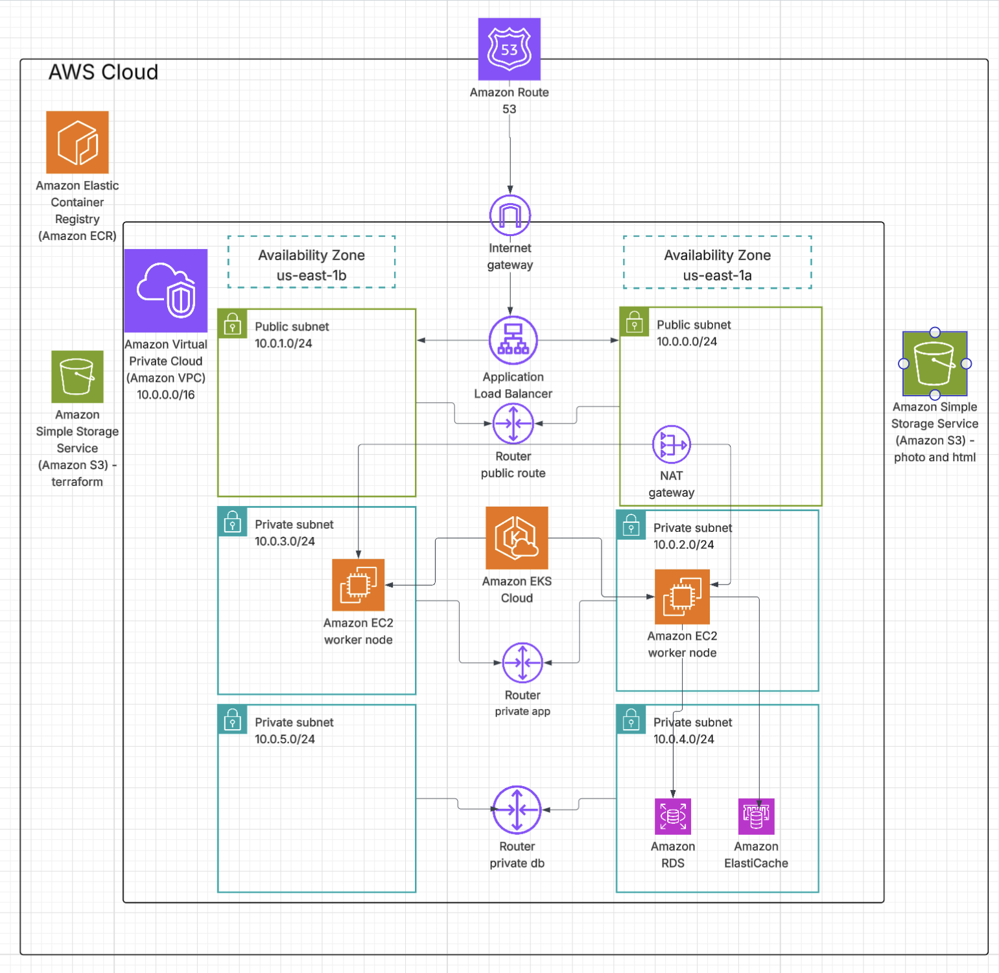
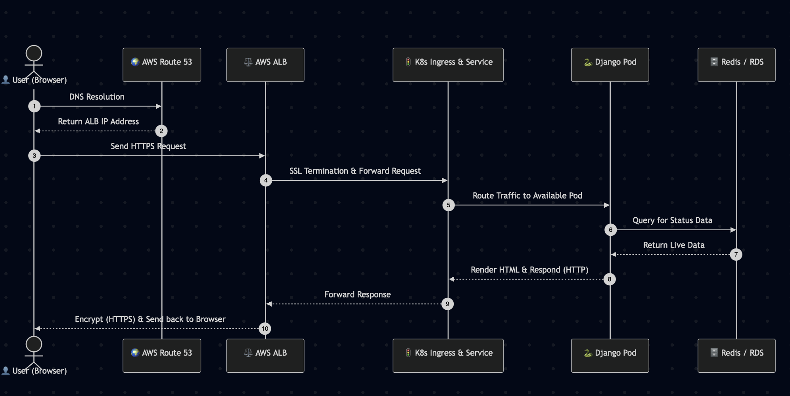
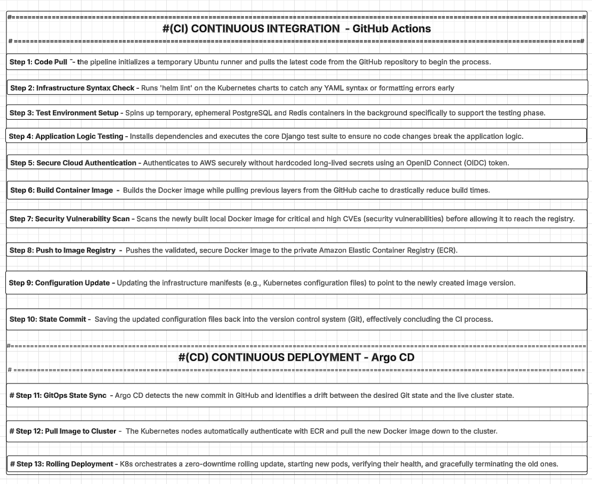
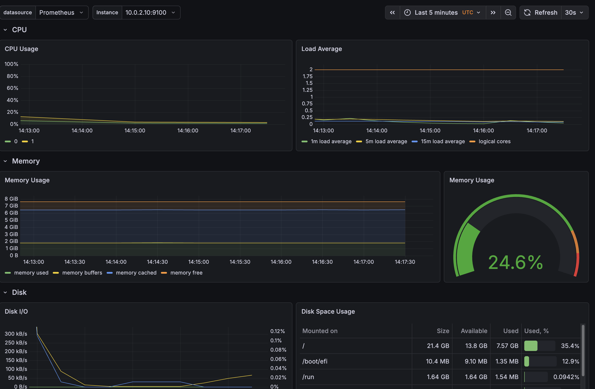
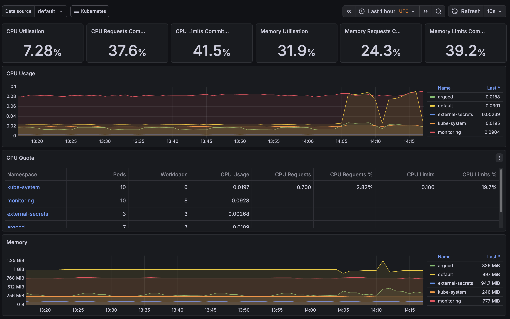

# 🚀 Enterprise Cloud-Native Status Page

A complete, production-ready DevOps pipeline and cloud infrastructure for a highly available Status Page application. This project demonstrates modern cloud-native practices, including Infrastructure as Code (IaC), GitOps, Shift-Left Security, and comprehensive CI/CD automation.

---

  
  
  
  
  
  
  
  
  
  
  
  

  
  
  

## 🏗️ Architecture Overview

Our environment is built on AWS and Kubernetes, ensuring high availability, security, and scalability.

**AWS VPC Infrastructure:**

**Kubernetes Application Architecture:**

**User Traffic Flow (Cache Hit/Miss Logic):**

### 🛠️ Tech Stack & Tools

**Cloud & Infrastructure:**
* **AWS:** EKS (Kubernetes), ECR (Container Registry), RDS (PostgreSQL), ElastiCache (Redis), ALB, Route 53.
* **IaC:** Terraform (Provisioning the entire AWS infrastructure).

**Containerization & Orchestration:**
* **Docker & Buildx:** Multi-stage, cached container builds.
* **Kubernetes (K8s):** Deployments, Services, Ingress, HPA (Horizontal Pod Autoscaler).
* **Helm:** Package manager for K8s manifests and templating.

**CI/CD & GitOps:**
* **GitHub Actions:** Continuous Integration, testing, and building.
* **Argo CD:** Continuous Deployment actively syncing cluster state with Git.

**Security & Observability:**
* **Trivy:** Container vulnerability scanning.
* **AWS OIDC:** Secretless authentication between GitHub and AWS.
* **Prometheus & Grafana:** Cluster monitoring and resource metrics.

---

## 🔄 CI/CD Pipeline (The GitOps Way)

Our deployment pipeline is fully automated, enforcing code quality and security before any code reaches the production cluster.

**The Complete CI/CD Flow:**

### 1. Continuous Integration (GitHub Actions)
1. **Shift-Left Testing:** Runs `helm lint` to validate infrastructure YAML and executes Django unit tests within ephemeral PostgreSQL/Redis service containers.
2. **Secretless Auth:** Uses AWS OIDC to authenticate securely.
3. **Optimized Build:** Utilizes Docker Buildx with GitHub caching to reduce build times by up to 80%.
4. **DevSecOps:** Scans the built image with **Trivy** for Critical/High CVEs.
5. **Publish & Update:** Pushes the secure image to Amazon ECR and uses `yq` to safely update the `image.tag` in the Helm `values.yaml` file, committing the new state back to Git.

### 2. Continuous Deployment (Argo CD)
* **Drift Detection:** Argo CD detects the new commit in the repository.
* **Automated Sync:** Pulls the new state and instructs the EKS cluster to pull the new image from ECR.
* **Rolling Update:** Kubernetes performs a zero-downtime deployment, utilizing Readiness and Liveness probes to ensure application health before routing traffic.

**Argo CD Live Sync Status:**

---

## 🛡️ Security & Best Practices Implemented

* **Least Privilege:** Kubernetes pods are configured with a strict `securityContext` (`runAsNonRoot: true`, dropping all capabilities).
* **High Availability:** Pod Anti-Affinity rules ensure application replicas are spread across different physical EC2 nodes.
* **Resource Management:** Strict CPU and Memory `requests` and `limits` are defined to prevent node starvation and enable the HPA.
* **State Isolation:** Application configuration is completely separated from the image.

---

## 📊 Monitoring & Observability

To ensure infrastructure stability and optimize resource allocation, the cluster is monitored using the Prometheus stack.

**Infrastructure Health (Node Exporter):**

**Application Pod Metrics (Compute Resources):**

---
*Developed as a comprehensive showcase of modern DevOps engineering practices.*
